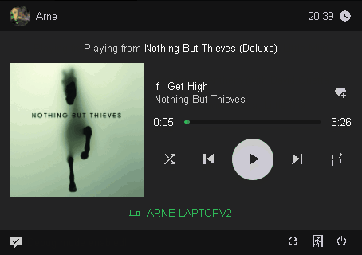

# Spotify Connect controller
Controls external Spotify Connect instances on small screen devices like the Raspberry Pi with a touchscreen



## Notice
Because I am not willing to host a webserver for this program, this repro will require you to register an application at Spotify to get a set with your client ID and client secret which you can use to get your access and refresh tokens. 

ONCE THESE KEYS ARE SET DO NO NOT DISTRIBUTE THIS APPLICATION AS THESE KEYS ARE STORED AS PLAINTEXT AND THUS AVAILABLE TO ANYONE WHO GETS ACCESS TO THEM! 

THIS PROGRAM IS MEANT FOR PERSONAL USE ONLY!

## Introduction
I apologise in advance for the terrible state of the git repo, I started in electron and then realised that I cannot run electron on ARMv6 targets anymore (like the Raspberry Pi Zero) and that was kind of the entire purpose of this program. I started this new repository and thus lost some commits. 

This program connects to your Spotify account to control sessions on other devices. I built it so that I can control my Spotify instance on my computer without having to open the app but it also works when casting to a Chromecast or Sonos speaker

## Installation
You will have to register an application on the Spotify Developers Dashboard and put the client id and client secret in `keys/tokens.json`, check the readme there for more info. 
Set the redirect url to any url that does not exist, like "https://localhost/"

Then run the following commands
```bash
git clone https://github.com/the-real-mcarn/spotify_connect_sio
cd spotify_connect_sio
npm install
npm run compile
```

These commands will only have to be run once if you are not editing the source. From now on you can use `npm start` to start the program

During the first run the program will give you a url you can use to authorise the application. Once you do so, Spotify will give you a access grant code in the redirect url, paste this code in `keys/tokens.json`, check the readme there for more info.

Restart the program, it should now be able to connect to your Spotify account.

Now the program will try to start a Chromium instance in kiosk mode if you are on Linux, if not you will have to start a web browser manually and browse to http://localhost:3000/. From there you will be able to control your Spotify session. 

The UI is designed to work on a 3.5'' Raspberry Pi display, however it can be scaled to fit your needs by editing `scss/style.scss` and running `npm run sc` to save your changes. 

`start.sh` can be used to start the program remotely, like over SSH. 